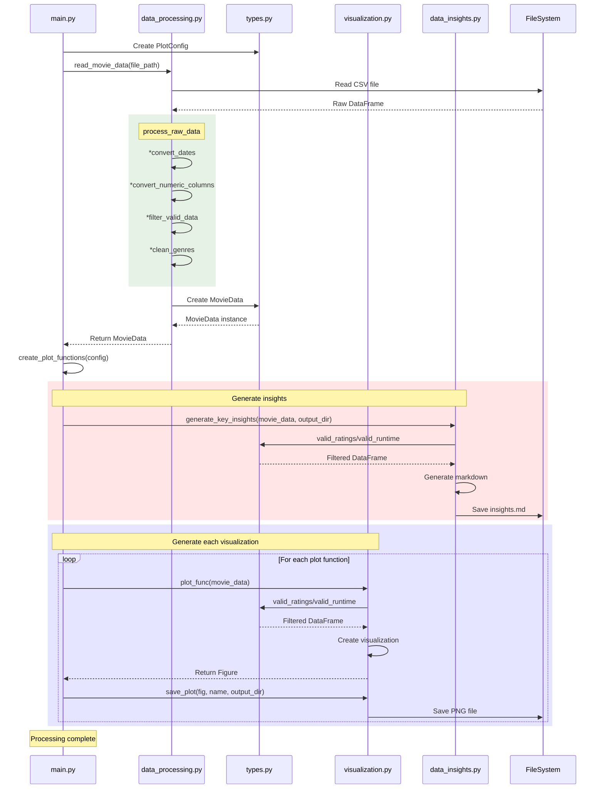

# Movie Analysis Project

Functional programming approach to movie data analysis and visualization.

## Project Structure

```
FunctionProgrammingLab/
├── src/
│   ├── utils/
│   │   ├── __init__.py
│   │   ├── config.py
│   │   ├── types.py
│   │   └── logger.py
│   ├── data_analysis/
│   │   ├── __init__.py
│   │   ├── data_insights.py
│   │   ├── data_processing.py
│   │   └── visualization.py
│   ├── __init__.py
│   └── main.py
├── data/         # Dane wejściowe
│   └── Rotten Tomatoes Movies.csv
├── plots/        # Wygenerowane wykresy
│   ├── movie_analysis_heatmap.png
│   ├── movie_analysis_genres.png
│   ├── movie_analysis_trends.png
│   └── movie_analysis_runtime.png
├── logs/         # Pliki logów
│   ├── main.log
│   ├── data_processing.log
│   ├── visualization.log
│   └── types.log
├── .gitignore
├── poetry.lock
├── pyproject.toml
└── README.md
```

## Sequence diagram and features


- Functional programming approach with immutable data structures
- Pure functions for data processing and visualization
- Type hints and runtime type checking
- Comprehensive test suite
- Poetry for dependency management

## Installation

1. Install Poetry if you haven't already:
```bash
curl -sSL https://install.python-poetry.org | python3 -
```

2. Install dependencies:
```bash
poetry install
```

## Usage

Run the analysis:
```bash
poetry run python src/main.py
```

Run tests:
```bash
poetry run pytest
```

## Key Principles

- Immutable data structures using `@dataclass(frozen=True)`
- Pure functions for all data transformations
- Function composition for data processing pipelines
- Strong type hints and validation
- Comprehensive error handling
- Clear separation of concerns
